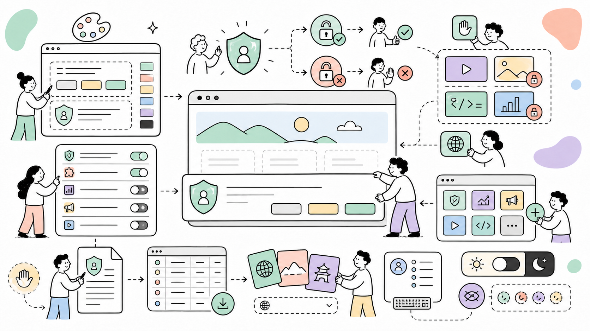

# Cookie

Cookie adds GDPR/ePrivacy-compliant cookie and privacy consent management to ProcessWire: a consent banner, preferences window, server-side auto-blocking of known trackers, an interactive visual builder and a consent log.



It fits any ProcessWire site that needs a compliant consent flow under GDPR/ePrivacy, CCPA/CPRA or similar privacy laws, without giving up control over design, blocking behavior or developer ergonomics.

**Author:** Maxim Semenov  
**Website:** [smnv.org](https://smnv.org)  
**Email:** [maxim@smnv.org](mailto:maxim@smnv.org)

If this project helps your work, consider supporting future development: [GitHub Sponsors](https://github.com/sponsors/mxmsmnv) or [smnv.org/sponsor](https://smnv.org/sponsor/).

## What Cookie Does

- Neutralizes known trackers and embeds server-side, in the rendered page, before consent — nothing third-party runs even if a developer forgets to mark it up.
- Supports opt-in (GDPR/ePrivacy, UK GDPR/PECR, LGPD, Law 25, POPIA, KVKK) and opt-out (CCPA/CPRA and other US state laws) consent models, plus Global Privacy Control.
- Adds category-based blocking for scripts, iframes, images and video, with placeholders offering *Load once* / *Always allow*.
- Includes a services catalog (23 known services, one-click add), a cookie policy generator, and an optional consent log with CSV export.
- Supports Google Consent Mode v2, consent expiry and versioning, body classes, a JS API and CustomEvents.
- Supports geo-based automatic model switching by visitor country.
- Ships multi-language texts with ready-made presets (8 languages) and per-language targeting for multi-language countries.
- Every decision point is hookable — block or restrict categories, the banner, gating rules and gated markup from `site/ready.php`.
- Provides a ProcessWire admin area (Design Studio) for building the widget visually, and settings import/export as JSON.

## Design Studio

Setup > Cookie opens the **Design Studio**, a two-pane live-preview builder where site editors can:

- pick a layout (box / bar / modal), an 8-point position, dim overlay, corner radius, shadows and spacing;
- choose the floating icon (7 built-in choices), its shape, size, position, color and shadow;
- style colors and fonts, with 50 one-click presets including sports-team palettes;
- enable and style a dark theme (`prefers-color-scheme: dark`) with its own 18 presets;
- preview on desktop or mobile, reset to defaults, or jump straight to text/behavior settings.

## Public Widget

Cookie renders a consent banner, a preferences window and a floating settings icon on the frontend, plus an optional cookie policy block via `$cookie->renderPolicy()`.

## Requirements

ProcessWire 3.0.244+, PHP 8.2+.

## Installation

1. Copy the `Cookie` folder to `/site/modules/`.
2. Install the **Cookie** module (installs ProcessCookie and TextformatterCookie).
3. Configure texts, categories and behavior: **Modules > Configure > Cookie**.
4. Design the widget: **Setup > Cookie** (permission: `cookie-admin`).
5. Optionally add **Cookie: Embed Blocker** to the text formatters of your RTE fields
   (after TextformatterVideoEmbed if you use it).

The banner, styles and scripts are injected automatically before `</head>` /
`</body>`. Enable *Manual render mode* in the config to place output yourself:

```php
echo $modules->get('Cookie')->renderHead();   // in <head>
echo $modules->get('Cookie')->renderBanner(); // before </body>
```

## Multi-language sites

All texts use ProcessWire's native multi-language fields, so the banner
already speaks whatever language is active for the visitor
(`Cookie::txt()` reads `{key}__{languageId}`, falling back to the default
language) — no extra setup beyond installing PW's Languages Support module.

The **Language presets** picker (module config > Texts) fills the *default*
language by one click. On a site with more than one PW language installed, a
**"Apply presets to language"** dropdown appears above the preset buttons —
pick a language, click a preset, repeat for the next language. This is the
practical way to set up a country with several official languages, e.g.:

- **Switzerland**: default = German, add French and Italian as PW languages,
  then apply "Deutsch" to German, "Français" to French, "Italiano" to Italian.
- **Belgium**: default = Dutch, add French and German, apply "Nederlands",
  "Français", "Deutsch" respectively.

Use **Custom…** to paste a JSON object (same keys as the built-in presets) for
a language that isn't listed, or for your own house-style wording — it
respects the same language-target dropdown.

## Consent models & regional laws

| Model | Laws | Behavior |
| --- | --- | --- |
| **Opt-in** (default) | GDPR + ePrivacy (EU), UK GDPR + PECR, LGPD (Brazil), Law 25 (Quebec), POPIA (South Africa), KVKK (Turkey), PDPL, nFADP (Switzerland, recommended) | Nothing optional runs before explicit consent; the banner requires a decision; reject is one click on every layer. |
| **Opt-out** | CCPA/CPRA (California), CPA (Colorado), VCDPA (Virginia), CTDPA (Connecticut), UCPA (Utah) and other US state laws | Optional categories run immediately; the banner is an informational notice (dismissable with Esc); visitors can refuse any time via the floating icon or a footer link. A **GPC signal automatically refuses the marketing category** — a legally binding opt-out under CCPA/CPRA and CPA. |

For CCPA also place the required footer link:

```php
echo $modules->get('Cookie')->renderTrigger('Do Not Sell or Share My Personal Information');
```

Different rules per region can be wired via the `Cookie::getFrontendConfig`
hook and your geo-IP source (see [Hooks](#hooks)).

### Geo mode

Enable *Geo mode* (module config) to pick the model by visitor country
automatically: opt-in for GDPR regions (EU/EEA, UK, Switzerland, Brazil…),
opt-out for US-style regions, and a configurable default for the rest (opt-in,
opt-out, or no banner). The country comes from the `CF-IPCountry` header
(Cloudflare and many CDNs set it); override the header name, set
`$config->geoCountry`, or hook `Cookie::detectCountry` to plug in a GeoIP
library. With full-page caching, vary the cache by country or exclude the config
script so visitors don't share one region's model.

## Consent-first auto-blocking

With *Consent-first auto-blocking* enabled (default), every rendered page is
gated before it reaches the browser: `<script src>` and `<iframe>` tags whose
URL matches a block rule are rewritten to the consent-gated form
(`type="text/plain"` / `data-src` + placeholder). Rules come from three layers,
later layers override earlier ones:

1. built-in tracker list (only in consent-first mode),
2. the *Embed domain map* config field (`domain=category` per line),
3. `Cookie::getBlockRules` hooks.

To leave a specific element alone, add `data-consent-ignore` to it. To skip
auto-gating on specific pages, hook `Cookie::allowGate`. Inline scripts are
never auto-gated (too easy to break the site) — mark those manually as shown
below. TextformatterCookie applies the same rules inside formatted fields, which
is only needed when auto-blocking is off (page-level gating already covers RTE
content).

## Blocking assets

```html
<!-- external script -->
<script type="text/plain" data-consent="statistics" src="https://example.com/analytics.js"></script>

<!-- inline script -->
<script type="text/plain" data-consent="marketing">
	fbq('init', '...');
</script>

<!-- iframe with placeholder -->
<iframe data-consent="external_media" data-placeholder="1"
	data-src="https://www.youtube-nocookie.com/embed/xyz"
	width="560" height="315" allowfullscreen></iframe>

<!-- image / video -->

<video data-consent="external_media" data-src="/video.mp4" data-poster="https://cdn.example/poster.jpg"></video>
```

Supported data attributes: `data-src`, `data-srcset`, `data-srcdoc`, `data-poster`,
`data-type` (restored type of scripts, default `text/javascript`),
`data-placeholder`, `data-placeholder-message`, `data-placeholder-button`.

Elements are unblocked **in place** (attributes and classes preserved); scripts are
re-created so they execute. All matching elements are processed (not just the first).
Scripts without `type="text/plain"` are never touched — they have already run — and a
console warning explains why.

### PHP helpers

```php
$cookie = $modules->get('Cookie');

echo $cookie->script('https://example.com/chat.js', 'functional');
echo $cookie->iframe('https://www.youtube-nocookie.com/embed/xyz', 'external_media', ['allowfullscreen' => '']);
echo $cookie->renderTrigger('Cookie settings');      // footer link reopening preferences
if($cookie->hasConsent('statistics')) { /* server-side conditional */ }
```

Any element with class `<prefix>-show-prefs` (default `pwcm-show-prefs`) opens the
preferences window — works for content added via AJAX too (delegated listener).

## JS API & events

```js
window.pwCookie.getConsent();          // {version, storedAt, valid, categories:{...}}
window.pwCookie.hasConsent('statistics');
window.pwCookie.allow('marketing');    // grant + save (silent)
window.pwCookie.revoke('marketing');
window.pwCookie.acceptAll();
window.pwCookie.rejectAll();
window.pwCookie.show();                // open banner
window.pwCookie.showPreferences();
window.pwCookie.refresh();             // re-process blocked elements (dynamic content)
window.pwCookie.reset();               // forget consent, show banner (testing)

document.addEventListener('pwcm:save', e => console.log(e.detail.consent, e.detail.revoked));
// also: pwcm:init, pwcm:show, pwcm:hide, pwcm:allow-once
```

Body classes when consent is granted: `consent-necessary`, `consent-statistics`, …
Useful for CSS-only conditional UI:

```css
body:not(.consent-marketing) .needs-marketing { display: none; }
```

## Hooks

Every decision point is hookable from `site/ready.php` — block or restrict
whatever you need:

```php
// Kill a category site-wide: its toggle disappears and all content mapped to it
// stays blocked, regardless of previously stored consent.
$wire->addHookAfter('Cookie::allowCategory', function($e) {
	if($e->arguments(0) === 'marketing') $e->return = false;
});

// Never auto-show the banner for logged-in users (widget stays reachable).
$wire->addHookAfter('Cookie::allowBanner', function($e) {
	if($e->wire()->user->isLoggedin()) $e->return = false;
});

// Add your own blocking rules (block Intercom until "functional" consent).
$wire->addHookAfter('Cookie::getBlockRules', function($e) {
	$rules = $e->return;
	$rules['widget.intercom.io'] = 'functional';
	$e->return = $rules;
});

// Skip consent-first auto-gating on selected pages.
$wire->addHookAfter('Cookie::allowGate', function($e) {
	if($e->arguments(0)->template == 'embed-sandbox') $e->return = false;
});

// Post-process the gated markup with custom logic.
$wire->addHookAfter('Cookie::gateHtml', function($e) {
	$e->return = str_replace('…', '…', $e->return);
});

// Restrict frontend behavior (e.g. force the banner closed outside the EU).
$wire->addHookAfter('Cookie::getFrontendConfig', function($e) {
	$cfg = $e->return;
	if(!myGeoIsEu()) $cfg['autoShow'] = false;
	$e->return = $cfg;
});
```

Also hookable: `renderHead`, `renderBanner`, `getTemplateFile`, `getCategories`,
`getIconSvg`.

## Template overrides

Copy `templates/banner.php` to `/site/templates/Cookie/banner.php` to fully customize
the markup.

## Admin interface language

The Design Studio's own interface (tabs, field labels, buttons — not the
visitor-facing banner text, which is handled by [Language presets](#multi-language-sites))
ships with ready-made translations for German, French, Italian, Spanish and
Dutch, following ProcessWire's standard module-translation mechanism
(`Modules::getModuleLanguageFiles()` + `languages/*.csv`).

To install one: **Setup > Modules > Cookie: Design Studio > "install
translations"** (link appears once Language Support is installed and at least
one non-default language page exists) → pick the CSV for each target language
→ Submit. The admin then sees the Design Studio in their own PW admin
language automatically. Requires ProcessWire's core **Language Support**
module — see [processwire.com/modules/language-support](https://processwire.com/modules/language-support/).

## Import / export settings

Setup > Cookie > Import / Export moves the whole configuration between sites as
one JSON blob (texts, categories, services, behavior, integrations, geo and
design). Download it or copy the JSON, then import it elsewhere by file or paste.
Only known config keys are applied (unknown keys are ignored) and the per-site
IP-hash salt is never transferred. Programmatic: `$cookie->exportSettings()` /
`$cookie->importSettings($data)`.

## Consent log

Enable in module config (Integrations). Records: timestamp, consent version, granted
categories, salted IP hash, truncated user agent. View/export: **Setup > Cookie >
Consent log**. Retention is configurable; old records are purged automatically.
The log endpoint (`/pwcm-cl/`) accepts only small JSON POST bodies and stores no
personal data in plain form (GDPR data minimization).

## Services (JSON)

```json
[
	{
		"name": "Google Analytics",
		"category": "statistics",
		"provider": "Google LLC",
		"purpose": "Traffic measurement",
		"duration": "2 years",
		"cookies": ["_ga", "_gid", "_gat"]
	}
]
```

Shown under "Details" of the category in the preferences window. On revocation the
listed cookie names are deleted (first-party) and the page reloads (configurable).

## Troubleshooting

- **Banner hidden by an ad blocker** — change the CSS prefix (Advanced) to any
  neutral string; markup, ids and classes are rewritten automatically.
- **GTM / Consent Mode** — enable Google Consent Mode v2 in Integrations and keep
  your gtag/GTM snippet *after* the module output (the module renders its default
  signals first in `<head>`).
- **Testing** — run `pwCookie.reset()` in the browser console to see the banner again.

## Documentation

See [CHANGELOG.md](CHANGELOG.md) for the release notes.

## Author

Maxim Semenov  
[smnv.org](https://smnv.org)  
[maxim@smnv.org](mailto:maxim@smnv.org)

## License

MPL-2.0
